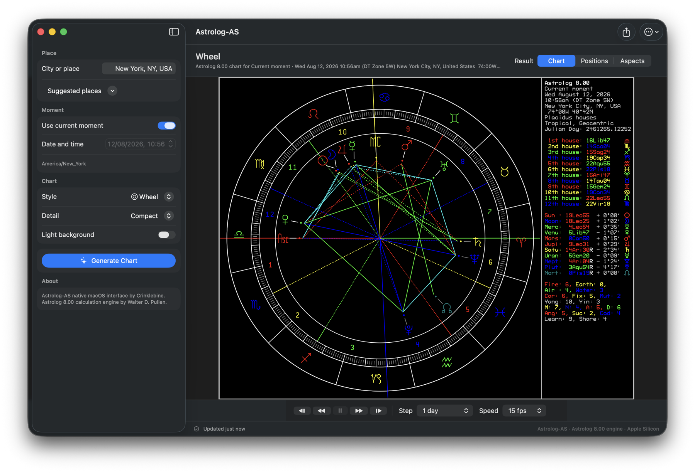

# Astrolog-AS

Astrolog-AS is an unofficial native Apple Silicon macOS interface by
Crinklebine for Walter D. Pullen's Astrolog 8.00 calculation and graphics
engine. It provides a focused Mac experience while retaining Astrolog as the
engine that calculates and renders each chart.



## Download and install

The current release is
[Astrolog-AS 8.00 (build 800.25)](https://github.com/Crinklebine/astrolog-as/releases/tag/v8.00-as.25).
Download the
[Apple Silicon DMG](https://github.com/Crinklebine/astrolog-as/releases/download/v8.00-as.25/Astrolog-AS-800.25-arm64.dmg).

Astrolog-AS requires an Apple Silicon Mac running macOS 14 Sonoma or later.

1. Open the downloaded DMG.
2. Drag `Astrolog-AS.app` to the Applications folder.
3. On first launch, right-click Astrolog-AS and choose **Open**.

The release is ad-hoc signed but is not signed with an Apple Developer ID or
notarized by Apple. macOS may therefore ask you to confirm that you want to
open it.

## Features

- Native macOS controls for place, date, time, chart style, and appearance.
- Wheel, Solar System, Local Horizon, Astrocartography, and Aspect Grid graphics.
- Engine-scale mouse-wheel zooming in the Solar System view, with double-click
  reset and close-range filled planetary disks.
- A structured Positions view generated from the same complete chart result as
  the graphic view.
- A sortable Aspects view with rank, bodies, aspect type, orb, and power.
- Right-click CSV copying from the Positions and Aspects views.
- Forward and reverse chart animation with single stepping, adjustable time
  increments, and playback rates from 1 to 60 frames per second or unthrottled.
  The balanced default is 15 frames per second, and Chart, Positions, and
  Aspects remain synchronized to each animated frame.
- Automatic time-zone and daylight-saving handling for place searches.
- Seattle as the initial location, with the last successful place remembered
  and one-click chart generation from suggested places.
- Scalable SVG charts with PNG and text-report export.
- Hover tooltips for planets, angles, zodiac signs, and houses in the Wheel,
  with focused relationship highlighting for planets, the Moon, and North Node.
- Concise symbol-name tooltips in the Local Horizon view.
- Object and geocentric AU-distance tooltips in the Solar System view.
- Automatic chart rerendering when the style, detail, or background changes,
  without changing the displayed chart's moment.
- Right-click chart copying and a dark chart background by default.
- A self-contained app that does not require XQuartz.

## Project layout

Walter D. Pullen's Astrolog engine source remains at the repository root. The
native SwiftUI application and its typed chart integration are under `macos/`.
The packaged application embeds the command-line engine and the runtime data it
needs.

Astrolog-AS is an independent, unofficial interface and is not an official
Astrolog release. Learn more about the original project at
[astrolog.org](https://www.astrolog.org/astrolog.htm).

## Build the native macOS app

Building the app requires an Apple Silicon Mac, macOS 14 or later, and Xcode
with the macOS SDK installed.

```sh
./scripts/build_macos_app.sh
```

The result is `dist/Astrolog-AS.app`.

## Build the command-line engine

The source tree also supports a native command-line build with SVG, PNG,
PostScript, and bitmap exports enabled while disabling the optional X11 window
layer. Apple Command Line Tools are sufficient for this build.

```sh
make -j8
```

The result is the `astrolog` executable in the repository root. Rebuild from
scratch with:

```sh
make clean
make -j8
```

Run Astrolog from the repository root so it can find `astrolog.as`, `atlas.as`,
`timezone.as`, `sefstars.txt`, and the `ephem` directory:

```sh
./astrolog -H
./astrolog -n -v
```

For example, look up Seattle using the bundled atlas and time-zone data:

```sh
./astrolog -n -zN "Seattle, WA, USA" -v
```

Generate chart graphics without X11:

```sh
./astrolog -n -zN "Seattle, WA, USA" -XV -Xo chart.svg
./astrolog -n -zN "Seattle, WA, USA" -Xbp -Xo chart.png
```

### Optional interactive engine windows

The native Astrolog-AS app does not need XQuartz. Interactive windows from the
engine itself require XQuartz and an X11-enabled rebuild. Install XQuartz,
uncomment `#define X11` in `astrolog.h`, and add the XQuartz include, library,
and runtime settings to the Makefile.

## Tests

Run the fixed-instant time-zone and daylight-saving tests with:

```sh
./scripts/test_macos_time.sh
```

Run the typed chart-result regressions against fixed New York and Seattle
reference charts with:

```sh
./scripts/test_macos_chart_result.sh
```

## On-demand DMG builds

The `Build Astrolog-AS DMG` workflow can be started manually from the
repository's Actions tab. It builds and tests the native Apple Silicon app,
packages a versioned DMG, and uploads it as the `Astrolog-AS-arm64` workflow
artifact for 30 days.

That 30-day limit applies only to the temporary Actions artifact. DMGs attached
to a GitHub release remain available with that release. Developer ID signing
and Apple notarization are not currently configured.

For every release, increment `CFBundleVersion` in `macos/Info.plist` and update
the current release and DMG links in this README before running the workflow.
After the workflow succeeds, attach its DMG artifact to a matching versioned
GitHub release.

## License and attribution

Astrolog is copyright Walter D. Pullen. Astrolog and the Astrolog-AS interface
contributions by Crinklebine are distributed under the GNU General Public
License version 2 or, at your option, any later version
([`GPL-2.0-or-later`](license.htm)). Third-party materials remain under their
respective licenses.
